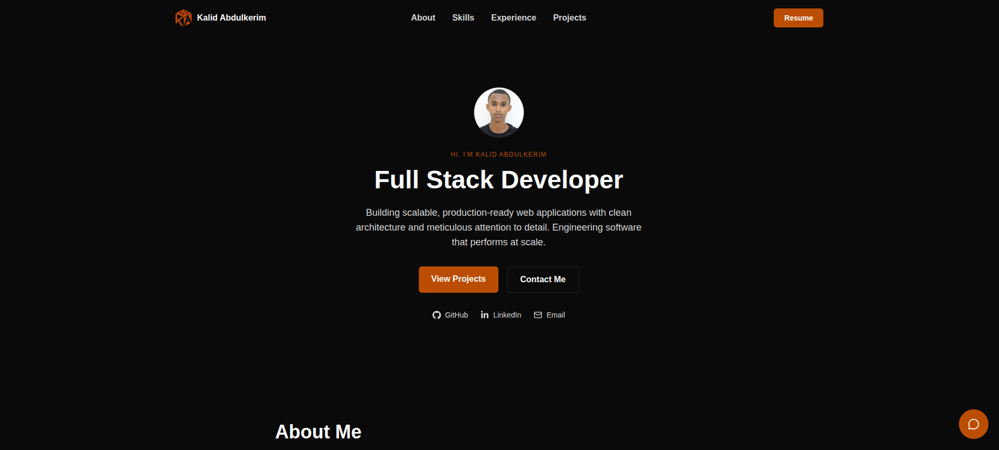
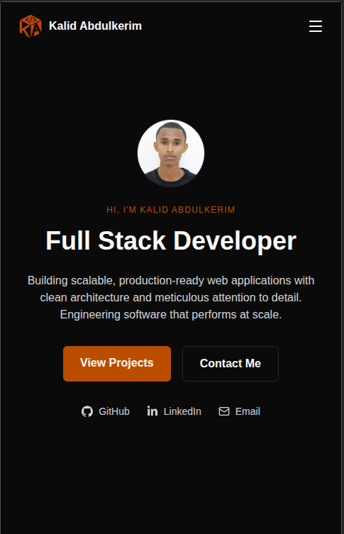

# Portfolio Website

Personal portfolio of **Kalid Abdulkerim**, a junior full-stack developer. It showcases my projects, skills, experience, and certifications, and includes a working contact form and an AI chat widget.

**Live site:** https://portfolio-website-ten-beta-77.vercel.app/

## Screenshots





## Features

- Single-page layout with sections: Hero, About, Skills, Experience, Featured Projects, Certifications, and Contact
- Sticky, responsive navbar with scroll-spy (highlights the section you're viewing) and an animated mobile menu
- Dark theme with amber accents, fully responsive
- Downloadable resume (PDF) available from the Hero and the navbar
- Contact form that sends messages to my email through the backend
- AI chat widget that answers questions about me, using the Gemini API and retrieval over my own knowledge base
- Smooth animations with Framer Motion

## Tech Stack

**Frontend**

- React 19 + Vite
- Tailwind CSS
- React Router v7
- Framer Motion
- Lucide React (icons)

**Backend**

- Node.js + Express 5
- PostgreSQL (hosted on Neon)
- Nodemailer and Resend (contact form emails)
- Google Gemini API (chat widget)

**Deployment**

- Frontend: Vercel
- Backend: Render

## Project Structure

```text
Portfolio-website/
├── frontend/                  # React + Vite app
│   ├── public/                # Static files (logo, favicon, resume.pdf)
│   └── src/
│       ├── components/        # Navbar, Footer, ChatWidget, SEO
│       ├── sections/          # Hero, About, Skills, Experience, Projects, Certifications, Contact
│       ├── pages/             # HomePage
│       ├── routes/            # React Router setup
│       ├── constants/         # Content data (projects, skills, experience, certifications, links)
│       ├── services/          # API calls to the backend (chat, contact)
│       └── styles/            # Global styles
└── backend/                   # Express API
    ├── server.js              # Entry point (checks the database, starts the server)
    ├── scripts/               # generateEmbeddings.js (builds the chatbot's embeddings)
    └── src/
        ├── app.js             # Express app setup
        ├── config/            # Database and environment config
        ├── routes/            # API route definitions
        ├── controllers/       # Request and response handling
        ├── services/          # Business logic (chat, contact, retrieval)
        ├── repositories/      # Database access
        ├── validators/        # Request validation
        ├── middlewares/       # Error handler, rate limiter
        ├── utils/             # Helpers (AppError, similarity)
        └── data/              # Chatbot knowledge base and embeddings
```

## Getting Started

### Prerequisites

- Node.js 18 or newer
- A PostgreSQL database (I use Neon)

### 1. Clone the repo

```bash
git clone https://github.com/Kalx6/Portfolio-website.git
cd Portfolio-website
```

### 2. Run the backend

```bash
cd backend
npm install
```

Create a `backend/.env` file:

```env
PORT=5000
NODE_ENV=development
DATABASE_URL=your_postgres_connection_string
CORS_ORIGIN=http://localhost:5173

# Contact form email
EMAIL_HOST=your_smtp_host
EMAIL_PORT=your_smtp_port
EMAIL_USER=your_email_address
EMAIL_PASS=your_email_password_or_app_password
EMAIL_TO=address_that_receives_messages
RESEND_API_KEY=your_resend_api_key

# Chat widget
GEMINI_API_KEY=your_gemini_api_key
```

Start the server:

```bash
npm run dev
```

### 3. Run the frontend

In a second terminal:

```bash
cd frontend
npm install
npm run dev
```

The app runs at http://localhost:5173 and talks to the backend at `http://localhost:5000` by default.

To point the frontend at a different backend (for example, a deployed one), create `frontend/.env`:

```env
VITE_API_BASE_URL=https://your-backend-url
```

> Never commit your `.env` files. They contain secrets.

## Updating the Resume

Replace `frontend/public/resume.pdf` with the new file, keeping the same name. The "View Resume" button and navbar link will serve it automatically.

## Author

**Kalid Abdulkerim**

- GitHub: [@Kalx6](https://github.com/Kalx6)
- LinkedIn: [kalid-abdulkerim](https://www.linkedin.com/in/kalid-abdulkerim-53055834b)
- Portfolio: https://portfolio-website-ten-beta-77.vercel.app/
